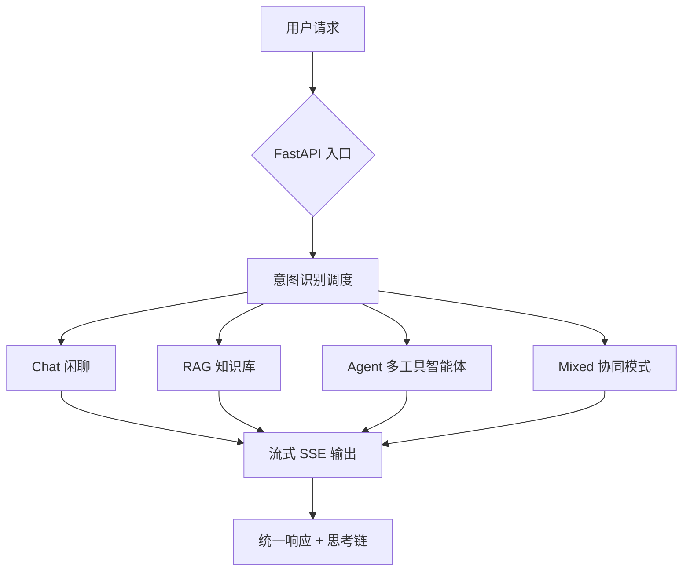
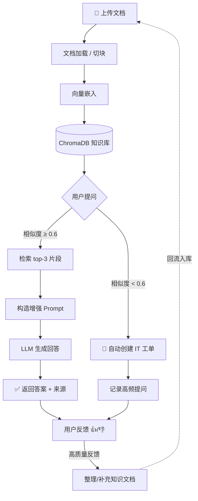
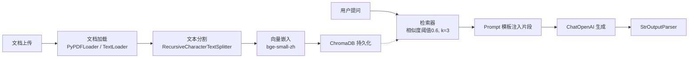
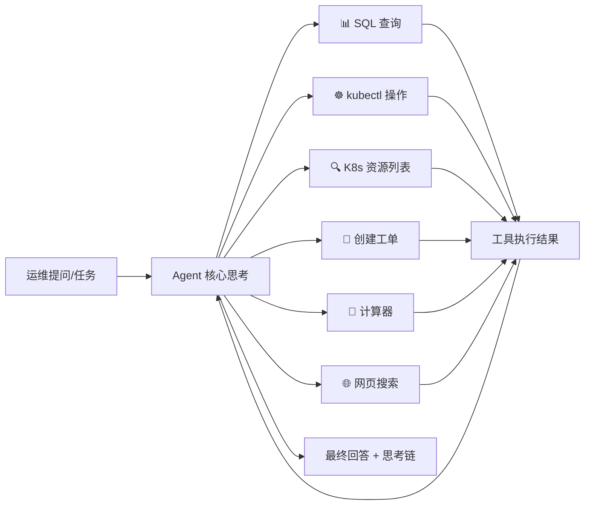
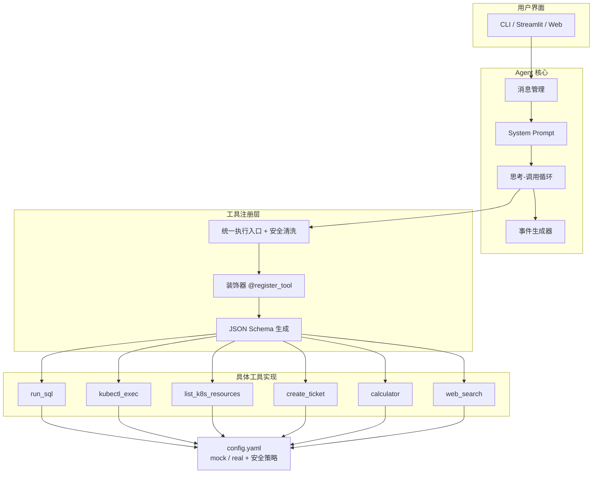
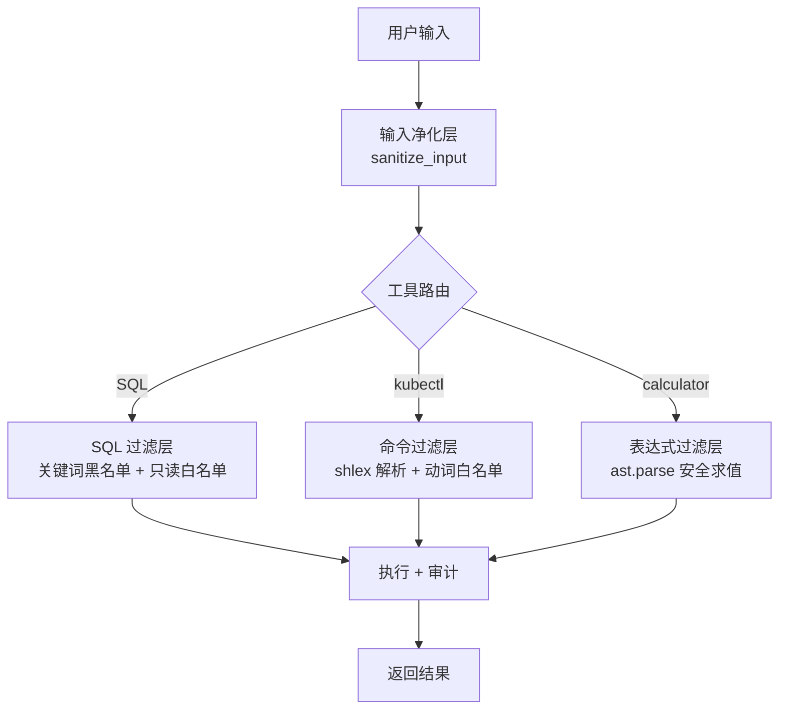

# 🤖 AI Backend Service — 智能 IT 运维助手

基于 **FastAPI** 的智能 IT 运维助手后端，集成 **RAG 知识库问答（含业务闭环）**、**单 Agent 多工具智能体**、**思考链可视化** 和 **流式对话** 四大核心能力，通过**意图驱动的调度层**实现请求智能路由。

[](https://fastapi.tiangolo.com/)
[](https://www.python.org/)
[](https://www.docker.com/)
[]()
[]()
[](LICENSE)

---

## 系统架构总览



一句话说明：所有请求先进入意图识别层，自动分流到闲聊、知识检索、自动化运维工具调用或混合模式。每步推理可追踪（思考链可视化），每个回答可溯源（检索来源），每次操作可审计（安全日志）。

---

## 项目亮点

| 亮点 | 说明 |
|------|------|
| 🧠 **意图识别中枢** | LLM 驱动的四分类路由（chat / rag / agent / mixed），一个入口覆盖所有场景 |
| 🔁 **RAG 业务闭环** | 检索 → 回答 → 工单 → 反馈 → 知识沉淀，知识库持续自进化 |
| 💭 **Agent 思考链可视化** | 每一步推理（思考→工具调用→工具结果→最终回答）结构化追踪，可直接渲染为前端面板 |
| ⚡ **流式输出 SSE** | RAG 问答和 Agent 推理均支持 Server-Sent Events 流式推送，首 token 延迟低 |
| 🛡️ **安全审计闭环** | SQL 注入防护 + 命令注入防护 + eval 替换 + 输入净化 + 纵深防御分层 |
| 🧪 **87 个自动化测试** | 单元测试覆盖 RAG 检索、Agent 工具、意图分类、安全防御，CI 可回归 |
| 🔄 **Mock / Real 一键切换** | `config.yaml` 中 `env: mock` → `env: real`，演示零风险，生产可落地 |
| 🐳 **Docker 即服务** | 一行命令部署完整后端，适配 Railway 等 PaaS 平台 |
| 📜 **Swagger 自动文档** | FastAPI 原生 `/docs`，每个接口都有交互式测试面板 |
| 📊 **RAG 评估框架** | 45 条中文 IT 运维评估集 + 自动化评估脚本（关键词 F1 / 来源命中率 / 拒答检测率） |

---

## 最近更新

**2026-06-21**

| 模块 | 更新内容 |
|------|---------|
| 🧪 测试体系 | 新增 87 个 pytest 单元测试，覆盖 RAG 检索器、Agent 工具注册/执行/模式切换、意图分类全链路、安全防御验证 |
| 📊 评估框架 | 新增 `evaluate_rag.py` + 45 条中文 IT 运维评估集 `data/eval_qa.json`，支持关键词 F1 / 来源命中率 / 拒答检测率 / 分类统计 |
| 💭 思考链可视化 | 新增 `POST /agent/think` + `POST /agent/think/stream`，结构化追踪 Agent 每一步推理，含 icon/label/color 前端渲染字段 |
| ⚡ RAG 流式输出 | 新增 `POST /rag/ask/stream`，SSE 逐 token 推送，先返回检索来源再流式生成回答 |
| 🛡️ 安全加固 | Calculator `eval()` → `ast.parse` 安全求值、K8s `shell=True` → `shlex + shell=False`、SQL 关键词过滤 + 只读白名单、工具入口输入净化 |
| 📚 知识库冷启动 | 新增 `scripts/seed_knowledge_base.py`，一键生成 10 大主题中文 IT 运维种子文档并索引到 ChromaDB |
| 📖 设计文档 | 新增 `docs/DESIGN.md` 技术选型设计文档 + `docs/SECURITY.md` 安全设计方案 + `docs/THOUGHT_CHAIN_DEMO.md` 思考链演示文档 |

---

## 技术栈

| 层级 | 技术 | 说明 |
|------|------|------|
| 后端框架 | **FastAPI** | 高性能异步框架，原生 OpenAPI 文档 |
| AI 编排 | **LangChain (LCEL + Agent)** | 链式声明式 API，RAG 检索增强生成 |
| 模型服务 | **通义千问 qwen-max** (DashScope) | 中文理解领先，兼容 OpenAI SDK |
| 向量数据库 | **ChromaDB** | 轻量级，零配置，Python 原生 |
| 文本嵌入 | **bge-small-zh** (HuggingFace) | 中文语义检索 SOTA，本地运行无需 GPU |
| 流式传输 | **SSE** (Server-Sent Events) | 单向推送，比 WebSocket 更轻量 |
| 容器化 | **Docker** | 多阶段构建，清华镜像源加速 |
| 部署平台 | **Railway** | 支持 `$PORT` 动态端口 |

---

## 核心业务架构

### 1. RAG 知识库问答（含业务闭环）

RAG 模块不只是简单的"检索-回答"，而是一个从文档入库到知识沉淀的**完整业务闭环**。



闭环逻辑：

- **常规路径**：知识库命中 → 回答 + 来源溯源 → 用户反馈
- **非常规路径**：知识库未命中 → 自动生成工单 → 记录高频问题 → 汇聚到用户反馈
- **关键闭环**：高质量反馈 → 整理成新文档 → 重新上传入库 → 知识库持续进化

<details>
<summary><b>📊 RAG 内部数据处理流水线</b></summary>



- **检索策略**：相似度阈值 0.6 + Top-K=3，保证召回质量
- **模型**：通义千问 `qwen-max`
- **链式调用**：完全基于 LangChain LCEL 构建，易于扩展
- **流式输出**：`POST /rag/ask/stream` 支持 SSE 逐 token 推送

</details>

---

### 2. Agent 智能运维多工具调用

采用 **单 Agent + 多工具（Function Calling）** 架构，模拟运维工程师的决策链。



业务特点：

- **思考链可视化**：每一步推理（思考→工具调用→工具结果→最终回答）结构化输出，含 icon/label/color 前端渲染字段
- **Mock / Real 无缝切换**：`config.yaml` 中 `env: mock` → `env: real`，演示零风险，生产可落地
- **自动化编排**：Agent 可连续调用多个工具（例如先查 Pod 状态 → 定位异常 Pod → 查日志 → 诊断根因 → 给出建议）
- **安全执行**：SQL 只读白名单 + K8s 命令白名单 + 输入净化 + 执行审计

<details>
<summary><b>🔧 Agent 分层设计</b></summary>



- **设计模式**：装饰器模式（工具自动注册）、适配器模式（环境切换）
- **安全清洗**：`execute_tool` 入口自动做长度截断 + 空字节过滤
- **模型**：`qwen-max`，兼顾推理能力与工具调用准确性

</details>

<details>
<summary><b>💭 思考链可视化示例</b></summary>

真实演示：用户输入"帮我查一下 Pod 状态"，Agent 经过 8 步推理自主完成诊断：

| Step | 类型 | 操作 | 关键发现 |
|------|------|------|---------|
| 1 | 💭 思考 | 分析意图 | 需要查 K8s Pod 状态 |
| 2 | ☸️ 工具调用 | `kubectl get pods` | — |
| 3 | 📋 工具返回 | 5 个 Pod 状态 | `user-svc-jkl` → CrashLoopBackOff (12 次重启) |
| 4 | 💭 思考 | 发现异常 | 决定深入排查 |
| 5 | ☸️ 工具调用 | `kubectl logs user-svc-jkl` | — |
| 6 | 📋 工具返回 | 日志内容 | "FATAL out of memory" |
| 7 | 💭 思考 | 综合分析 | 根因定位 |
| 8 | ✅ 回答 | 诊断 + 建议 | OOM → 增加内存限制 / 排查内存泄漏 |

完整 JSON 响应见 `tests/fixtures/thought_chain_demo.json`，演示文档见 `docs/THOUGHT_CHAIN_DEMO.md`。

</details>

---

## 快速开始

### 1. 克隆仓库

```bash
git clone https://github.com/2442511245/FastAPI-IT-Assistant.git
cd FastAPI-IT-Assistant
```

### 2. 安装依赖

```bash
python -m venv venv
source venv/bin/activate   # Windows: venv\Scripts\activate
pip install -r requirements.txt
```

### 3. 配置环境变量

```bash
export DASHSCOPE_API_KEY="你的阿里云 API Key"
# 或创建 config.txt 写入 Key（仅本地开发）
```

### 4. 冷启动知识库（可选，推荐）

```bash
# 一键生成 10 大主题中文 IT 运维种子文档并索引
python scripts/seed_knowledge_base.py
```

### 5. 启动服务

```bash
uvicorn main:app --reload
# Swagger UI → http://localhost:8000/docs
# 健康检查 → http://localhost:8000/
```

### 6. Docker 一键部署

```bash
docker build -t my-ai-backend .
docker run -p 8000:8000 -e DASHSCOPE_API_KEY="your-key" my-ai-backend
```

---

## 在线演示

已部署在 Railway，可在线体验所有接口：

👉 `https://fast-api-it-assistant.railway.internal/docs`

---

## API 接口总览

| 接口 | 方法 | 类型 | 说明 |
|------|------|------|------|
| `/` | GET | — | 健康检查 |
| **RAG 知识库** | | | |
| `/rag/upload` | POST | JSON | 上传文档（PDF/TXT），构建/更新知识库 |
| `/rag/ask` | POST | JSON | 知识库问答（未命中自动创建工单） |
| `/rag/ask/stream` | POST | **SSE** | 🆕 流式问答（先返回来源，再逐 token 生成） |
| `/rag/feedback` | POST | JSON | 用户反馈（有用/无用） |
| `/rag/stats` | GET | JSON | 工单统计 |
| **Agent 智能体** | | | |
| `/agent/chat/stream` | POST | SSE | Agent 多工具调用（流式事件） |
| `/agent/think` | POST | JSON | 🆕 思考链可视化（非流式，完整 JSON） |
| `/agent/think/stream` | POST | **SSE** | 🆕 思考链可视化（流式，逐步推送） |
| **Chat 对话** | | | |
| `/chat/send` | POST | JSON | 非流式多轮对话 |
| `/chat/stream` | POST | SSE | 流式多轮对话 |
| **Orchestrator 调度** | | | |
| `/orchestrator/assist` | POST | JSON | ⭐ 统一入口：意图识别后自动分流 |

所有接口均可在 Swagger UI（`/docs`）中交互式测试。

---

## 安全设计

本项目已完成首轮安全审计修复，覆盖 OWASP Top 10 for LLM 中的关键风险。



### 纵深防御分层

| 层级 | 防护内容 | 实现位置 |
|------|---------|---------|
| 第 1 层：输入净化 | 长度截断（4096）+ 空字节过滤 | `tools/__init__.py` → `sanitize_input()` |
| 第 2 层：命令解析 | shell=False + shlex 安全分词 | `tools/k8s_tool.py` |
| 第 3 层：关键词过滤 | SQL 禁止关键词 + 只读命令白名单 | `tools/sql_tool.py` → `validate_sql()` |
| 第 4 层：安全求值 | ast.parse 白名单运算符 | `tools/calculator_tool.py` → `_eval_ast()` |
| 第 5 层：策略配置 | SQL/K8s/Calculator 安全策略集中管理 | `config.yaml` → `security:` 段 |
| 第 6 层：审计记录 | 工具调用全链路可观测 | 待 Phase 2 实现 |

### 已修复风险

| 风险 | 等级 | 修复方案 | Commit |
|------|------|---------|--------|
| `eval()` 代码注入 | 🔴 高危 | 替换为 `ast.parse` + 白名单运算符 | `9ab6ab0` |
| `shell=True` 命令注入 | 🔴 高危 | 替换为 `shlex.split` + `shell=False` | `0b49ba0` |
| SQL 注入 + 无权限控制 | 🔴 高危 | 新增 `validate_sql` 关键词过滤 + 只读白名单 | `a61b042` |
| 工具入口无输入清洗 | 🔴 高危 | `sanitize_input` 长度截断 + 空字节过滤 | `ac9a2a9` |
| 缺少安全策略声明 | 🟡 中危 | `config.yaml` 新增 `security:` 配置段 | `1437fb4` |

完整安全设计见 [`docs/SECURITY.md`](docs/SECURITY.md)。当前已完成应用层防护（输入净化、命令解析、SQL 过滤、安全求值），企业级 RBAC 权限控制和高危操作审批工作流在后续版本规划中，属于分阶段落地策略。

---

## 测试体系

```bash
# 运行全部 87 个测试
pytest tests/ -v

# 按模块运行
pytest tests/test_rag_retriever.py -v     # RAG 检索器 (17 个)
pytest tests/test_agent_tools.py -v        # Agent 工具注册/执行/切换 (25 个)
pytest tests/test_orchestrator.py -v       # 意图识别分流 (25 个)
pytest tests/test_security.py -v           # 安全防御验证 (20 个)
```

| 测试模块 | 数量 | 覆盖范围 |
|---------|------|---------|
| `test_rag_retriever.py` | 17 | 检索召回、相似度阈值过滤、Top-K 控制、文档加载/切分、Chain 集成 |
| `test_agent_tools.py` | 25 | 装饰器注册、工具执行、Mock/Real 切换、Schema 验证、参数校验 |
| `test_orchestrator.py` | 25 | 意图分类、边界异常、集成分流、输入兼容性、端到端流程 |
| `test_security.py` | 20 | Calculator eval 注入、SQL 关键词过滤、K8s 命令注入、审计链路 |

### RAG 评估指标

| 指标 | 说明 |
|------|------|
| Keyword Recall | 回答中命中的期望关键词 / 总期望关键词数 |
| Keyword F1 | Precision 和 Recall 的调和平均 |
| Source Rate | 检索到来源文档的问题比例 |
| Out-of-KB Detect Rate | 知识库外问题被正确识别（拒答）的比例 |

评估数据集：`data/eval_qa.json`（45 条中文 IT 运维问答，覆盖 11 个分类）

评估脚本：`python evaluate_rag.py --limit 10`

---

## 技术选型

| 组件 | 选择 | 理由 |
|------|------|------|
| 向量数据库 | **ChromaDB** | 轻量级、零配置、Python 原生；当前定位单机部署、数据量万级以内，后续可迁移至 Milvus 支持更大规模 |
| LLM | **通义千问 qwen-max** | 中文理解能力领先，DashScope API 稳定，兼容 OpenAI SDK |
| 嵌入模型 | **bge-small-zh** | 中文语义检索 SOTA，体积小（~100MB），本地运行无需 GPU |
| AI 框架 | **LangChain LCEL** | 链式声明式 API，类型安全，可组合性强 |
| Agent 框架 | **自研装饰器模式** | 零外部 Agent 依赖，工具注册 3 行代码，事件流完全可控 |
| 流式传输 | **SSE** | 单向推送，比 WebSocket 更轻量，浏览器原生支持 |
| 测试框架 | **pytest + unittest.mock** | Python 标准测试生态，mock 外部 API 零成本 |

---

## 文件夹结构

```
FastAPI-IT-Assistant/
├── main.py                     # FastAPI 入口，路由注册
├── evaluate_rag.py             # RAG 评估脚本（45 条评估集）
├── requirements.txt            # Python 依赖
├── Dockerfile                  # 生产部署镜像
├── Dockerfile.local            # 本地开发镜像（清华源）
│
├── rag/                        # RAG 模块
│   ├── router.py               # API 路由（upload / ask / feedback / stats）
│   ├── stream_router.py        # 🆕 流式路由（ask/stream SSE）
│   ├── core/
│   │   ├── rag.py              # RAG 链（加载→分割→嵌入→检索→生成）
│   │   ├── ticket.py           # 工单管理
│   │   ├── feedback.py         # 用户反馈
│   │   └── stats.py            # 统计
│   └── models/                 # 本地嵌入模型 (bge-small-zh)
│
├── agent/                      # Agent 模块
│   ├── router.py               # API 路由（chat/stream）
│   ├── think_router.py         # 🆕 思考链可视化路由（think / think/stream）
│   ├── agent_core.py           # Agent 核心（思考→工具调用循环）
│   ├── config.py               # 配置数据类
│   ├── config.yaml             # 配置文件（含安全策略段）
│   ├── data/                   # 测试数据（SQLite + tickets.json）
│   └── tools/
│       ├── __init__.py         # 工具框架（装饰器 + 注册表 + 安全清洗）
│       ├── sql_tool.py         # SQL 查询（含安全过滤）
│       ├── k8s_tool.py         # kubectl 操作（含命令注入防护）
│       ├── ticket_tool.py      # 工单创建
│       ├── calculator_tool.py  # 计算器（安全求值）
│       └── search_tool.py      # 网页搜索
│
├── chat/                       # 对话模块
│   └── router.py               # API 路由（send / stream）
│
├── orchestrator/               # 调度模块
│   ├── router.py               # API 路由（assist 统一入口）
│   └── classifier.py           # LLM 意图分类
│
├── scripts/                    # 工具脚本
│   └── seed_knowledge_base.py  # 知识库冷启动（生成种子文档 + 索引）
│
├── docs/                       # 文档
│   ├── DESIGN.md               # 技术选型设计文档
│   ├── SECURITY.md             # 安全设计方案 + 审计整改记录
│   └── THOUGHT_CHAIN_DEMO.md   # 思考链演示文档（面试展示用）
│
├── tests/                      # 测试
│   ├── test_rag_retriever.py   # RAG 检索器测试 (17)
│   ├── test_agent_tools.py     # Agent 工具测试 (25)
│   ├── test_orchestrator.py    # 意图调度测试 (25)
│   ├── test_security.py        # 🆕 安全防御测试 (20)
│   └── fixtures/
│       └── thought_chain_demo.json  # 思考链测试 fixture
│
├── data/                       # 数据文件
│   ├── eval_qa.json            # 中文 IT 运维评估集 (45 条)
│   └── seed_knowledge.txt      # 种子知识文档 (10 大主题)
│
└── chroma_db/                  # ChromaDB 向量库（持久化）
```
