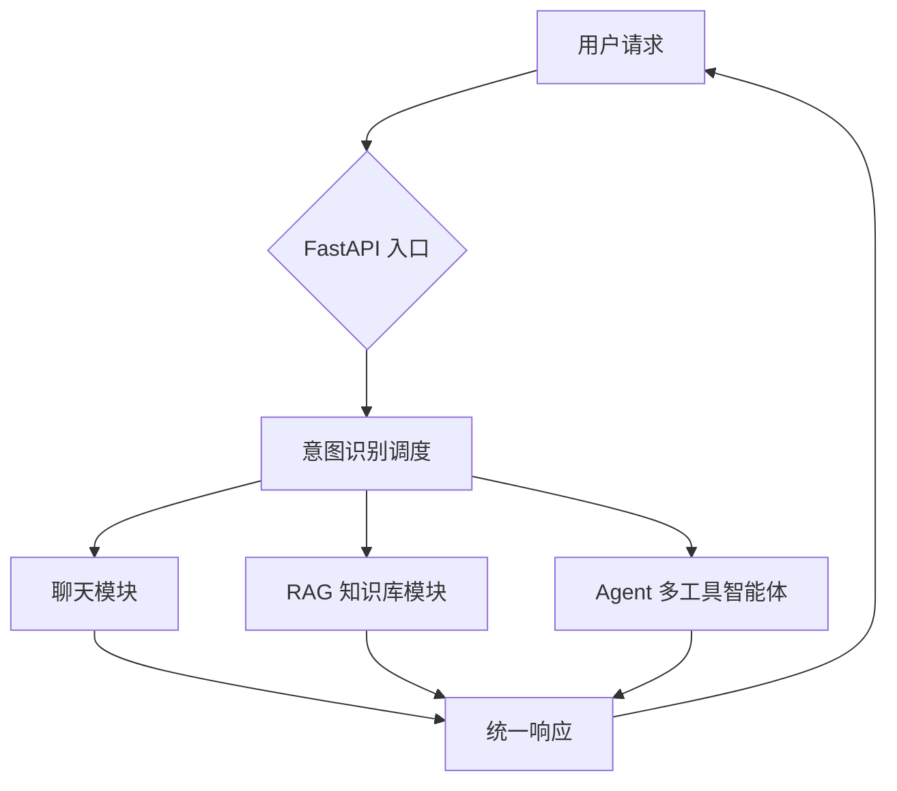
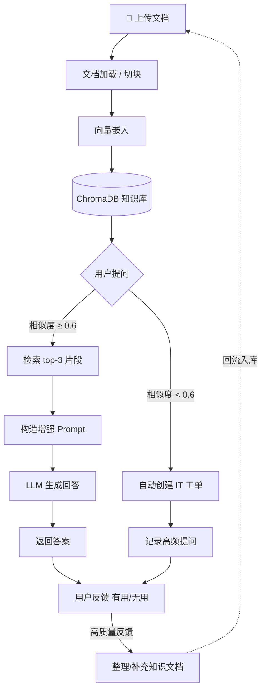
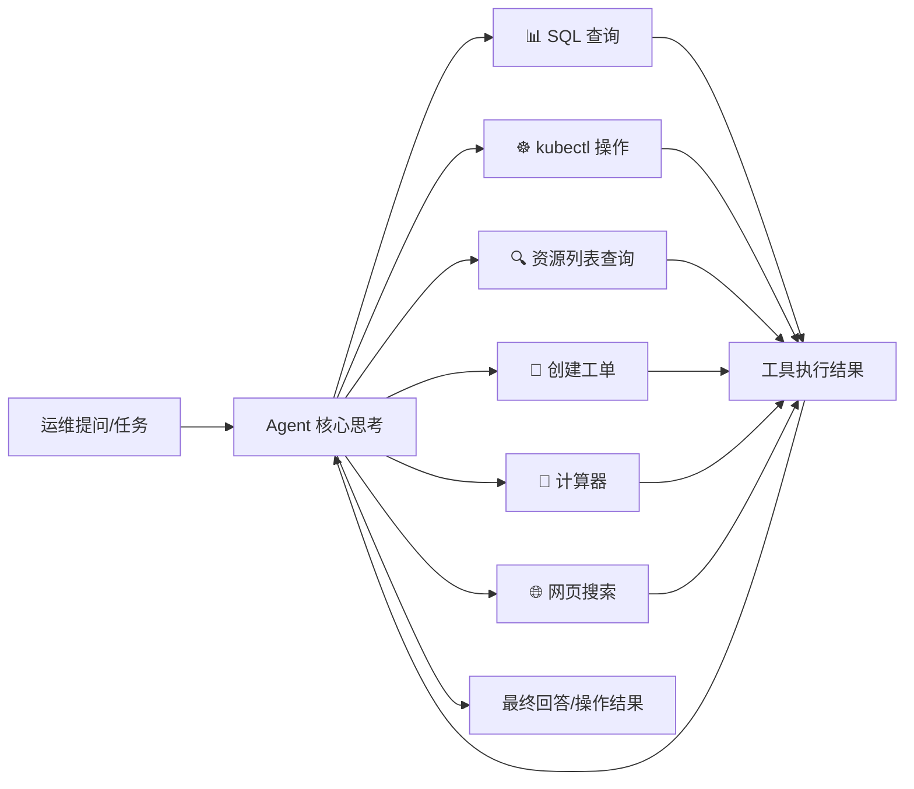
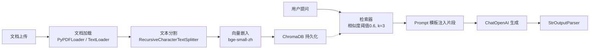
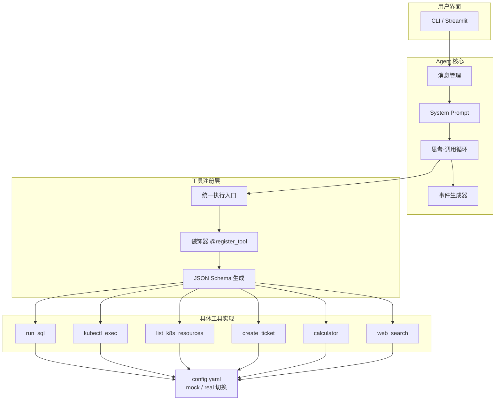

```markdown
# 🤖 AI Backend Service (RAG + Agent + Chat)

一个基于 **FastAPI** 的智能 IT 运维助手后端，集成 **RAG 知识库问答（带业务闭环）**、**单 Agent 多工具智能体** 和 **多轮对话** 三大核心模块，通过**意图驱动的调度层**实现请求智能路由。

[](https://fastapi.tiangolo.com/)
[](https://www.python.org/)
[](https://www.docker.com/)
[](LICENSE)

```

## 系统架构总览



一句话说明：所有请求先进入意图识别层，根据用户意图自动分流到闲聊、知识检索或自动化运维工具调用，三个模块共享统一的上下文与响应格式。

---

技术栈

| 层级 | 技术 |
|------|------|
| 后端框架 | FastAPI |
| AI 编排 | LangChain (LCEL + Agent) |
| 模型服务 | 通义千问 (DashScope) |
| 向量数据库 | ChromaDB |
| 文本嵌入 | bge-small-zh (HuggingFace) |
| 容器化 | Docker |
| 部署平台 | Railway |

---

核心业务架构

1. RAG 知识库问答（含业务闭环）

RAG 模块不只是简单的“检索-回答”，而是一个从文档入库到知识沉淀的完整业务闭环。



闭环逻辑：

- **常规路径**：知识库命中 → 回答 → 用户反馈
- **非常规路径**：知识库未命中 → 自动生成工单 → 记录高频问题 → 汇聚到用户反馈
- **关键闭环**：用户反馈中的高质量内容 → 整理成新文档 → 重新上传入库 → 知识库持续进化

---

2. Agent 智能运维多工具调用

采用单 Agent + 多工具（Function Calling） 架构，模拟运维工程师的决策链。



业务特点：

- **生产/演示无缝切换**：通过 `config.yaml` 中的 `env` 字段（`mock` / `real`），一键切换模拟工具调用与真实 K8s / 数据库操作，演示安全、落地可靠。
- **自动化编排**：Agent 可以连续调用多个工具（例如先查 Pod 状态，再根据结果执行重启命令），无需人工干预。

---

模块技术架构（展开查看细节）

<details>
<summary><b>RAG 内部数据处理流水线</b></summary>



- **检索策略**：基于相似度阈值（0.6）保证召回质量
- **模型**：通义千问（`qwen-plus` / `qwen3.6-plus`）
- **链式调用**：完全基于 LangChain LCEL 构建，易于扩展

</details>

<details>
<summary><b>Agent 分层设计</b></summary>



- **设计模式**：装饰器模式（工具自动注册）、适配器模式（环境切换）
- **模型**：`qwen-flash`，兼顾速度与推理能力
</details>

---

快速开始

1. 克隆仓库

```bash
git clone https://github.com/2442511245/FastAPI-IT-Assistant.git
cd FastAPI-IT-Assistant
```

2. 安装依赖

```bash
python -m venv venv
source venv/bin/activate   # Windows: venv\\Scripts\\activate
pip install -r requirements.txt
```

3. 配置环境变量

```bash
export DASHSCOPE_API_KEY="你的阿里云API Key"
# 或创建 config.txt 写入 Key（仅本地开发）
```

4. 启动服务

```bash
uvicorn main:app --reload
# 浏览器打开 http://localhost:8000/docs 查看交互式文档
```

5. Docker 一键部署

```bash
docker build -t my-ai-backend .
docker run -p 8000:8000 -e DASHSCOPE_API_KEY="your-key" my-ai-backend
```

---

在线演示

已部署在 Railway：
👉 https://你的域名.railway.app/docs
（可在线体验所有接口）

---

API 接口总览

| 接口 | 方法 | 说明 |
|------|------|------|
| `/rag/upload` | POST | 上传文档，构建/更新知识库 |
| `/rag/ask` | POST | 知识库问答（自动判断命中/未命中，未命中则生成工单） |
| `/agent/chat` | POST | Agent 多工具调用（SQL、k8s、工单等） |
| `/chat/send` | POST | 多轮对话 |
| `/orchestrator/assist` | POST | **统一入口**：意图识别后自动分流 |

---

项目特色

| 特色 | 说明 |
|------|------|
|🧠 意图识别中枢 | 一个入口，多种能力，自动路由 |
| 🔁 RAG 业务闭环 | 检索-回答-工单-反馈-知识沉淀 |
|🛠️ 单 Agent 多工具 | 真实/模拟环境一键切换，安全演示 |
| 🐳 Docker 即服务 | 一行命令部署完整后端 |
| 📜 自动文档 | FastAPI 自带 Swagger UI，无需额外写文档 |

---

文件夹结构（精简版）

```
FastAPI-IT-Assistant/
├── main.py               # FastAPI 入口
├── core/                 # 意图识别、配置
├── rag/                  # RAG 模块（加载、分割、检索、生成）
├── agent/                # Agent 工具实现
├── chat/                 # 对话管理
├── orchestrator/         # 统一调度
├── chroma_db/            # 向量库本地存储
├── requirements.txt
├── Dockerfile
└── README.md
```
